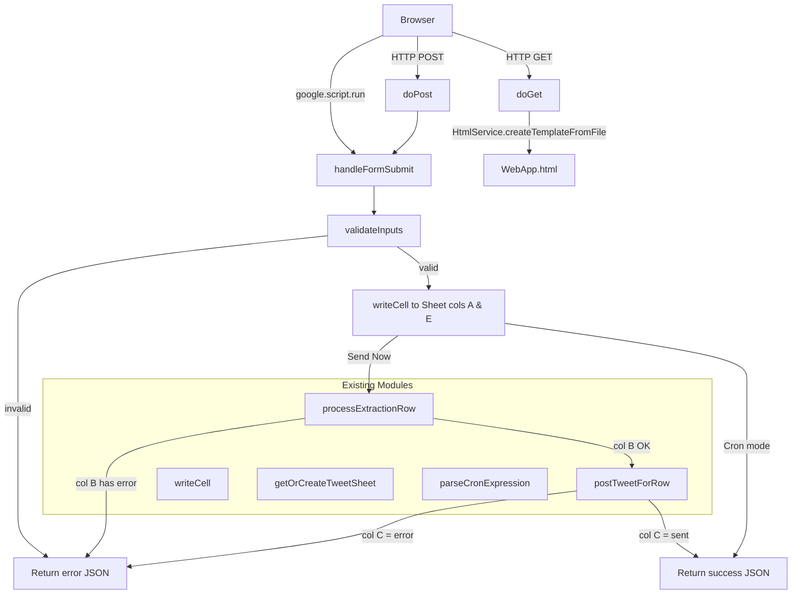

# Design Document: Tweet Web App UI

## Overview

This feature adds a Google Apps Script Web App to the existing tweet-resource-extractor project. The web app exposes a browser-accessible HTML form that lets users submit tweet links for either immediate posting ("Send Now") or scheduled posting via a cron expression. It integrates with the existing `SheetUtils`, `Extractor`, `Poster`, and `Scheduler` modules without modifying them.

The implementation consists of two new files:
- **`WebApp.gs`** — server-side `doGet()` and `doPost()` handlers
- **`WebApp.html`** — the HTML/CSS/JS form template served by `HtmlService`

The web app follows the standard Google Apps Script Web App pattern: `doGet()` serves the HTML page, and the client-side JavaScript calls `google.script.run` to invoke `doPost`-equivalent server functions asynchronously (since `doPost` is only invoked by external HTTP POST, not by `google.script.run`). The server-side handler function is named `handleFormSubmit(params)` and is called from the client via `google.script.run`.

### Key Design Decisions

1. **`google.script.run` instead of a raw `doPost`**: The form uses `google.script.run.handleFormSubmit(params)` rather than a native HTML form POST. This avoids a full page reload on submission (satisfying Requirement 8.1) and keeps the response handling in client-side JavaScript. The `doPost(e)` function is still implemented for completeness (Requirement 9) and delegates to the same `handleFormSubmit` logic.

2. **Server-side validation mirrors client-side**: Tweet URL and cron expression validation are performed server-side in `WebApp.gs`. Client-side validation provides fast feedback but is not relied upon for correctness.

3. **No new sheet columns or schema changes**: The web app writes only to the existing five columns (A–E) using the existing `writeCell()` and `getOrCreateTweetSheet()` functions.

4. **Immediate extraction/posting reads back from the sheet**: After writing a new row, `processExtractionRow()` is called, which writes to columns B and D. The handler then reads those values back from the sheet to check for errors before calling `postTweetForRow()`.

---

## Architecture



---

## Components and Interfaces

### `WebApp.gs`

#### `doGet(e)`
- Returns `HtmlService.createTemplateFromFile('WebApp').evaluate().setTitle('Tweet Scheduler')`
- No parameters are used from `e`

#### `doPost(e)`
- Reads `e.parameter.tweetLink`, `e.parameter.scheduleMode`, `e.parameter.cronExpression`
- Delegates to `handleFormSubmit({ tweetLink, scheduleMode, cronExpression })`
- Returns `ContentService.createTextOutput(JSON.stringify(result)).setMimeType(ContentService.MimeType.JSON)`

#### `handleFormSubmit(params)`
- **Input**: `{ tweetLink: string, scheduleMode: string, cronExpression?: string }`
- **Output**: `{ success: boolean, message?: string, error?: string }`
- Validates `tweetLink` (non-empty, matches URL pattern)
- If `scheduleMode === 'cron'`: validates `cronExpression` via `parseCronExpression()`
- Writes new row to sheet via `getOrCreateTweetSheet()` and `writeCell()`
- If `scheduleMode === 'now'`: calls `processExtractionRow()`, checks col B, calls `postTweetForRow()`, checks col C
- If `scheduleMode === 'cron'`: returns success immediately after writing

#### `_validateTweetLink(url)`
- Internal helper; returns `null` if valid, or an error string if invalid
- Checks non-empty and matches `/https?:\/\/(twitter\.com|x\.com)\/[^/]+\/status\/\d+/`

#### `_getNewRowIndex(sheet)`
- Internal helper; returns `sheet.getLastRow() + 1` (the 1-based index of the next empty row)

### `WebApp.html`

A single HTML file containing inline CSS and JavaScript, served via `HtmlService.createTemplateFromFile`.

**Form fields:**
| Field | Type | Name attribute |
|---|---|---|
| Tweet Link | `<input type="text">` | `tweetLink` |
| Schedule Mode | `<input type="radio">` | `scheduleMode` (values: `now`, `cron`) |
| Cron Expression | `<input type="text">` | `cronExpression` |

**Client-side JS responsibilities:**
- Toggle visibility of the cron expression field based on radio selection
- On form submit: collect values, call `google.script.run.withSuccessHandler(onSuccess).withFailureHandler(onFailure).handleFormSubmit(params)`
- `onSuccess(result)`: display `result.message` or `result.error` in the Feedback Area; if success, clear tweet link and reset to "Send Now"
- `onFailure(err)`: display the error in the Feedback Area; retain form values

---

## Data Models

### Form Submission Parameters

```javascript
{
  tweetLink:      string,   // e.g. "https://x.com/user/status/123456"
  scheduleMode:   string,   // "now" | "cron"
  cronExpression: string    // only present/used when scheduleMode === "cron"
}
```

### Handler Response Object

```javascript
// Success
{ success: true,  message: string }

// Failure
{ success: false, error: string }
```

### Sheet Row Written (columns A–E, 1-based)

| Col | Constant | Value written by Web App |
|-----|----------|--------------------------|
| A | `COL_TWEET_LINK` | The validated tweet URL |
| B | `COL_RESOURCE_LINKS` | `""` (written later by Extractor) |
| C | `COL_STATUS` | `""` (written later by Poster/Scheduler) |
| D | `COL_TITLE` | `""` (written later by Extractor) |
| E | `COL_CRON` | `""` (Send Now) or the cron string (Cron mode) |

> Columns B, C, D are left empty at write time. For "Send Now", `processExtractionRow()` fills B and D, then `postTweetForRow()` fills C — all within the same `handleFormSubmit` call.

### Validation Rules

**Tweet Link:**
- Must be non-empty (after trimming)
- Must match: `/https?:\/\/(twitter\.com|x\.com)\/[^\/]+\/status\/\d+/`

**Cron Expression (when scheduleMode === 'cron'):**
- Must be non-empty (after trimming)
- Must return a non-null result from `parseCronExpression()`

---

## Correctness Properties

*A property is a characteristic or behavior that should hold true across all valid executions of a system — essentially, a formal statement about what the system should do. Properties serve as the bridge between human-readable specifications and machine-verifiable correctness guarantees.*


### Property 1: Invalid tweet URL is rejected without writing to the sheet

*For any* string submitted as `tweetLink` that is empty, whitespace-only, or does not match the pattern `https?://(twitter\.com|x\.com)/[^/]+/status/\d+`, calling `handleFormSubmit` SHALL return `{ success: false, error: <message> }` and SHALL NOT append any new row to the sheet.

**Validates: Requirements 2.2, 2.3**

### Property 2: Valid tweet URL is written to column A

*For any* valid tweet URL (matching the required pattern), calling `handleFormSubmit` with that URL SHALL write that exact URL string to column A (`COL_TWEET_LINK`) of the newly appended row.

**Validates: Requirements 2.4, 6.1**

### Property 3: "Send Now" mode writes empty string to column E

*For any* valid tweet URL submitted with `scheduleMode = "now"`, the value written to column E (`COL_CRON`) of the new row SHALL be the empty string `""`.

**Validates: Requirements 3.5**

### Property 4: Valid cron expression is written to column E

*For any* valid cron expression (one that `parseCronExpression()` returns non-null for) submitted with `scheduleMode = "cron"`, the value written to column E (`COL_CRON`) of the new row SHALL equal the submitted cron string exactly.

**Validates: Requirements 3.6, 4.3, 6.1**

### Property 5: Invalid or empty cron expression is rejected without writing to the sheet

*For any* string submitted as `cronExpression` with `scheduleMode = "cron"` that is empty, whitespace-only, or causes `parseCronExpression()` to return `null`, calling `handleFormSubmit` SHALL return `{ success: false, error: <message> }` and SHALL NOT append any new row to the sheet.

**Validates: Requirements 4.1, 4.2**

### Property 6: Extraction error prevents posting; extraction success allows posting

*For any* "Send Now" submission where `processExtractionRow()` writes a value beginning with `"error:"` to column B, `handleFormSubmit` SHALL return `{ success: false }` and SHALL NOT call `postTweetForRow()`. Conversely, *for any* "Send Now" submission where column B does not begin with `"error:"` after extraction, `postTweetForRow()` SHALL be called.

**Validates: Requirements 5.2, 5.3**

### Property 7: Posting error is propagated in the response

*For any* error string written to column C (`COL_STATUS`) by `postTweetForRow()` (i.e., any value beginning with `"error:"`), `handleFormSubmit` SHALL return `{ success: false, error: <string> }` where the error detail from column C is included in the response.

**Validates: Requirements 5.5**

### Property 8: Cron mode never calls extraction or posting

*For any* valid `(tweetLink, cronExpression)` pair submitted with `scheduleMode = "cron"`, `handleFormSubmit` SHALL NOT call `processExtractionRow()` or `postTweetForRow()`.

**Validates: Requirements 6.3**

### Property 9: Response object always has the required shape

*For any* input to `handleFormSubmit` (valid or invalid, any schedule mode), the returned object SHALL always be JSON-serialisable and SHALL contain a `success` field (boolean) and exactly one of `message` (string, when `success` is `true`) or `error` (string, when `success` is `false`).

**Validates: Requirements 9.4**

### Property 10: Validation error message identifies the invalid field

*For any* submission that fails validation (empty URL, invalid URL, empty cron, invalid cron), the `error` string in the response SHALL contain a reference to the field that failed validation (e.g., "tweet link" or "cron expression").

**Validates: Requirements 7.3**

### Property 11: Runtime error detail from extraction/posting appears in the response

*For any* error string produced by `processExtractionRow()` (written to col B) or `postTweetForRow()` (written to col C), that error detail SHALL appear verbatim or as a substring in the `error` field of the `handleFormSubmit` response.

**Validates: Requirements 7.4**

### Property 12: Successful submission triggers form reset

*For any* successful `handleFormSubmit` call, the client-side `onSuccess` handler SHALL clear the tweet link input field and reset the schedule mode selection to `"now"`.

**Validates: Requirements 8.2**

### Property 13: Failed submission retains form values

*For any* failed `handleFormSubmit` call, the client-side `onFailure` handler SHALL NOT clear the tweet link input field or the cron expression input field.

**Validates: Requirements 8.3**

---

## Error Handling

### Validation Errors (client returns `{ success: false, error: "..." }`)

| Condition | Error message |
|---|---|
| `tweetLink` is empty or whitespace | `"Tweet link is required."` |
| `tweetLink` does not match URL pattern | `"Tweet link must be a valid twitter.com or x.com status URL."` |
| `scheduleMode === "cron"` and `cronExpression` is empty/whitespace | `"Cron expression is required."` |
| `scheduleMode === "cron"` and `parseCronExpression()` returns null | `"Cron expression is invalid. Use 5-field format: minute hour dom month dow."` |

### Runtime Errors (propagated from existing modules)

| Source | Condition | Handling |
|---|---|---|
| `processExtractionRow()` | Writes `"error: ..."` to col B | Read col B after call; if starts with `"error:"`, return `{ success: false, error: <col B value> }` |
| `postTweetForRow()` | Writes `"error: ..."` to col C | Read col C after call; if starts with `"error:"`, return `{ success: false, error: <col C value> }` |
| `getOrCreateTweetSheet()` | Throws (e.g., no active spreadsheet) | Wrap in try/catch; return `{ success: false, error: "Sheet error: " + e.message }` |
| Any unexpected exception | Uncaught error in `handleFormSubmit` | Wrap entire body in try/catch; return `{ success: false, error: "Unexpected error: " + e.message }` |

### Client-Side Error Display

- All errors are displayed in the `#feedback` div with a CSS class `error` (red styling)
- All success messages are displayed with a CSS class `success` (green styling)
- The feedback div is hidden on page load and shown after any submission

---

## Testing Strategy

### Dual Testing Approach

This feature uses both unit/example-based tests and property-based tests.

**Unit tests** cover:
- Specific rendering checks (page title, form fields present, radio defaults)
- Specific success/error message content
- `doPost` parameter extraction
- `doGet` return type

**Property-based tests** cover:
- Input validation logic across the full space of valid/invalid inputs
- Round-trip correctness (values written to sheet match submitted values)
- Conditional call logic (extraction/posting gating)
- Response shape invariant

### Property-Based Testing Library

Use **[fast-check](https://github.com/dubzzz/fast-check)** (the existing test suite already uses Jest; fast-check integrates with Jest). Add `fast-check` as a dev dependency in `appscript/tests/package.json`.

Each property test runs a minimum of **100 iterations**.

### Test File

New test file: `appscript/tests/unit/webApp.test.js`

The test file mocks:
- `getOrCreateTweetSheet()` — returns a mock sheet object
- `writeCell()` — records calls
- `processExtractionRow()` — configurable to write success or error values to col B
- `postTweetForRow()` — configurable to write "sent" or "error: ..." to col C
- `parseCronExpression()` — delegates to the real implementation (pure function, no side effects)

### Property Test Tags

Each property-based test is tagged with a comment in the format:
```
// Feature: tweet-web-app-ui, Property N: <property_text>
```

### Test Coverage Map

| Property | Test type | Description |
|---|---|---|
| P1 | Property | Invalid URLs rejected without sheet write |
| P2 | Property | Valid URL written to col A |
| P3 | Property | Send Now writes empty col E |
| P4 | Property | Valid cron written to col E |
| P5 | Property | Invalid cron rejected without sheet write |
| P6 | Property | Extraction error gates posting |
| P7 | Property | Posting error propagated in response |
| P8 | Property | Cron mode skips extraction/posting |
| P9 | Property | Response shape invariant |
| P10 | Property | Validation error names the field |
| P11 | Property | Runtime error detail in response |
| P12 | Property | Success clears form (client-side) |
| P13 | Property | Failure retains form values (client-side) |
| 1.3 | Example | Page title is "Tweet Scheduler" |
| 3.1–3.2 | Example | Radio buttons present, "Send Now" default |
| 5.4 | Example | "sent" in col C → success=true |
| 6.2 | Example | Cron success message contains "scheduled" |
| 7.2 | Example | "now" and "cron" success messages differ |
| 9.2–9.3 | Example | doPost reads correct parameters |
| 9.5 | Example | doPost returns JSON ContentService output |
